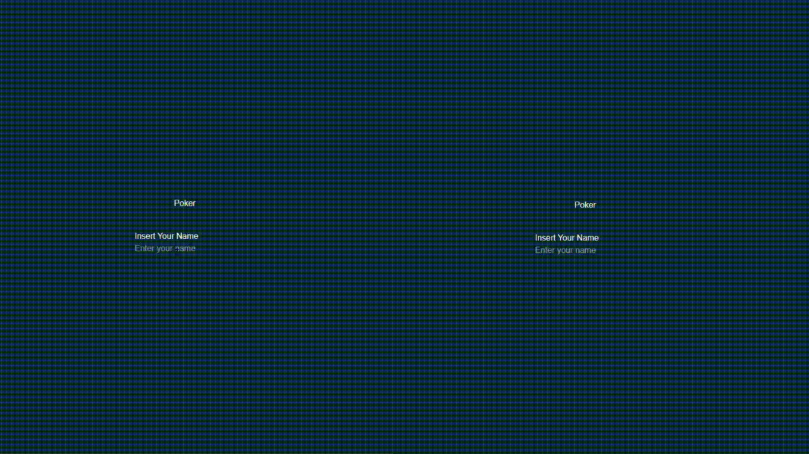
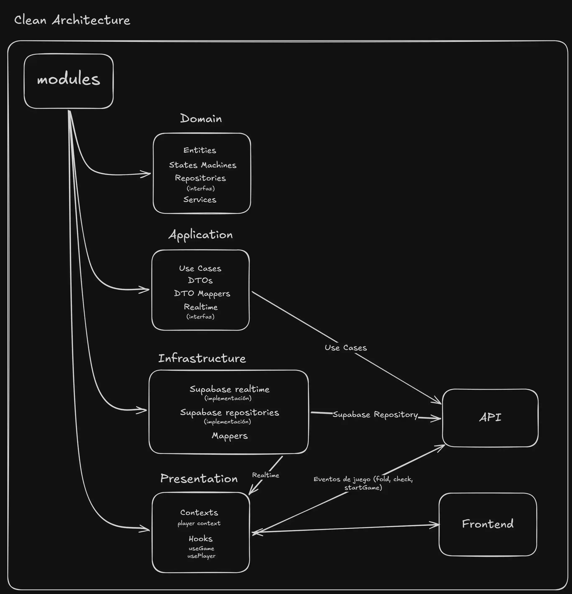

# Poker Online
Aplicación de póker online en tiempo real que permite múltiples jugadores 
interactuando en una misma partida de forma sincronizada.

## Demo

[Ver demo](https://poker-seven-umber.vercel.app/)



## Features
- Juego en tiempo real entre múltiples jugadores
- Gestión de salas
- Sincronización de estado entre clientes
- Sistema de turnos

## Stack
- Next.js
- Supabase (DB + Realtime)
- TypeScript

## Decisiones Técnicas

- El stack se eligió priorizando la rapidez de desarrollo y la capacidad de iterar con demos funcionales desde el inicio.
- Next.js permitió un enfoque fullstack sencillo, mientras que Supabase facilitó la implementación de funcionalidades en tiempo real.
- A medida que el proyecto creció, se introdujeron mejoras en la arquitectura para separar la lógica del juego del resto del sistema, mejorando la escalabilidad y mantenibilidad.


## Aquitectura


## Instalación

```bash
git clone ...
npm install
npm run dev
```
## Roadmap
Consulta las próximas mejoras aquí:
[Roadmap](TODOS.md)

## Más información

Puedes leer la evolución del proyecto en mi portfolio:
[Artículo completo]([juanruiz.dev/blog/poker](https://juanruiz.dev/blog/poker/))


